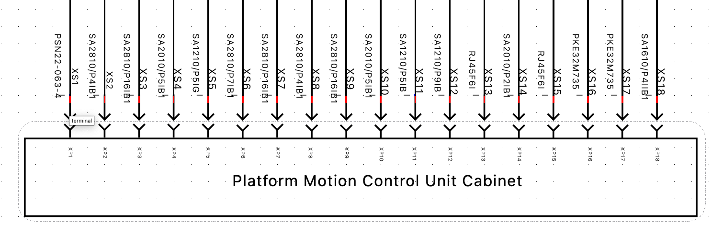
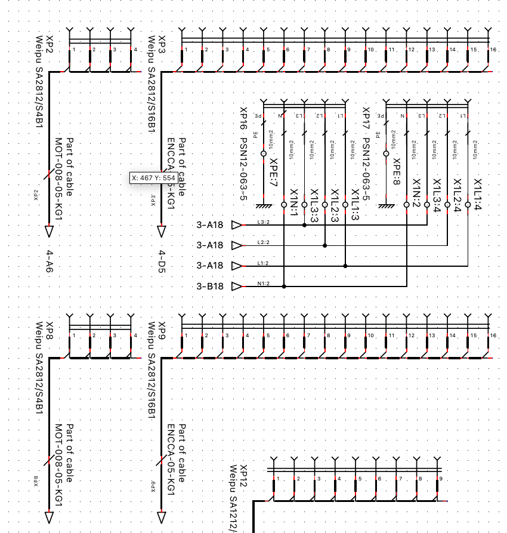

# qguide 
---
> [!abstract] **Проектирование принципиальных схем в qelectrotech**  
> Данный гайд не претендует на полноту освещения всех вопросов связанных с работой в программе и ее установкой. Свод правил касающихся оформления репозитория с проектом а также структуры самого проекта и входящих в состав документов является **обязательным**.

## Установка qeletcrotech

- Для разработки требуется использовать версию 0.9 скачать [тут](https://github.com/qelectrotech/qelectrotech-source-mirror/releases/tag/0.9) под свою платформу. 
- После установки клонировать с помощью git клиента например [SourceTree](https://www.sourcetreeapp.com) пользовательские библиотеки [отсюда](https://github.com/RoboticsHardwareSolutions/qguide/tree/main/qlib). Данная библиотека содержит в себе  библиотеку элементов **elements** и библиотеку шаблонов листов **titlebloks**  : ![[attach/lib_dir.png|400]]

- В программе qeletcrotech требуется указать данные директории в качестве директорий пользовательских: ![[attach/directory_to_lib.png]]


## Установка плагина для генерации клемных блоков

Далее для работы генератора клемных блоков устанавливаем python
Инструкция по установке встроена в само  ПО:  ![[attach/plagin_instr.png]]

### Windows:

![[attach/plagin_win.png]]

Устанавливаем Python версии 3.5 или выше.
Если поставили отдельный питон, не забываем добавлять полный путь до pip3.
Устанавливаем плагин qet_tb_generator:
```bash
pip3 install qet_tb_generator
```
Находим место установки скрипта:
```bash
pip3 show qet_tb_generator
```

![[attach/pip3_show_qet_tb_generator.png]]

В выводе находим расположение скрипта в зависимости от типа установки и версии python:

```bash    
Location: c:\users\user_name\appdata\local\programs\python\python36-32  
```

```bash
Location: c:\users\user_name\appdata\roaming\python\python310
```

Скрипт можно найти в папке Scripts
Запускаем:

```bash
C:\Users\user_name\AppData\Roaming\Python\Python310\Scripts\qet_tb_generator
```

![[attach/win_QET_Terminal_Block_Generator_v131.png]]
### macOS:

Устанавливаем [python](https://www.python.org/downloads/) версию 3.9 и сам плагин через pip:

```bash
$ pip3 install qet_tb_generator
```

![[attach/plagin.png]]

Для проверки работоспособности плагина запускаем его должно появиться окно с выбором проекта для генерации клемм: 

![[attach/qet_tb_gen.png|500]]
 
## Общая структура проектов 

### Примеры декомпозиции проектов

Каждый проект требует первоначальной декомпозиции по аналогии нижеописанными примерами :

**Пример 1:**  
Проект автоматизированной системы управления конвейерной линии должен быть разбит на два подпроекта = два репозитория = два проекта qelectrontech. Первый должен содержать в себе проект qelectrontech для внешнего оборудования (датчики, привода, актуаторы) с кабельным "журналом" и схемами подключения к шкафам/шкафу автоматики второй проект = репозиторий = проект qelectrontech шкафа автоматики который управляет конвейером.(если шкафов несколько то на каждый по своему проекту qelectrontech = репозиторию ).  Проекты и репозитории относящиеся к одному и тому же объекту должны быть частью одной группы в gitlab.  
**Пример 2:**   
Объект управления представляет из себя набор исполнительных устройств приводов и датчиков например часть робота а также  свой отдельный шкаф управления исполнительными устройствами. Такая АСУ разбивается также на два проекта первый проект содержит все исполнительные устройства кабели, датчики к ним и схему подведения к шкафу автоматики, второй проект содержит непосредственно схему шкафа автоматики. Оба проекта размещаются в одной группе gitlab.   
**Пример 3:**  
Схема шкафа автоматики зарядной станции. Данный пример не требует разбиения на отдельные подпроекты ввиду малого количества внешний подключений. Весь проект размещается в рамках одного репозитория. 

### Общая структура репозитория 

Каждый проект qelectrotech оформляется в виде отдельного репозитория и должен иметь следующую структуру:

![[attach/rep_struct.png|400]]

* в корне репозитория должен находиться файл проекта c расширением `.qet`
* в корне проекта должна находиться папка `doc`
* в корне проекта должен находиться файл  `README.md` подробней [тут](https://guides.hexlet.io/ru/markdown/) и [тут](https://lifehacker.ru/luchshie-redaktory-s-podderzhkoy-markdown/) .

**Папка `doc` должна содержать в себе документацию относящуюся только к данному проекту а именно:**  

* .pdf файл полностью совпадающий по названию с файлом проекта содержащий в себе страницы проекта.  
* `parts list_XXXX.csv` файл с полной спецификацией (не путать с номенклатурой - номенклатура должна содержаться на последних листах проекта, ниже есть описание как подготовить номенклатуру и спецификацию).  
* папка `schematic_previews` - содержащая в себе изображения всех листов проекта в формате `.png `

## Работа над проектом  qelectrotech

**В общем случае работа над любым проектом подразумевает следующие шаги:**  
* декомпозиция проекта на под проекты  
* создание git репозитория для будущего проекта / группы проектов и клонирование созданного на компьютер  
* создание проекта и выбор шаблона листов   
* создание нумерации цепей/компонентов/клеммных блоков   
* дополнение библиотеки компонентов требуемыми элементами для текущего проекта   
* создание принципиальной схемы (назначение сечений проводников и/или типов используемого готового кабеля происходит в процессе создания схемы)  
* генерация листов клеммных блоков и их последующее соединение  
* генерация листов номенклатуры   
* генерация спецификации (part list_xxxxx.csv).  
* генерация .png файлов в папку `schematic_previews`.  
* заполнение файла README.md   
* выгрузка вновь созданных элементов библиотеки в репозиторий с библиотеками (ссылка выше) в отдельную [ветвь](https://selectel.ru/blog/tutorials/how-to-work-with-branches-in-git-git-branch/) репозитория с названием проекта для которого добавляются данные элементы (или любое осмысленное название) и создание запроса на слияние с  master/main  ветвью.   
* выгрузка самого проекта в репозиторий после проверки структуры и содержания на соотвествие описанию выше. Выгрузка осуществляется в предварительно созданную ветвь develop     
*  Предварительное ревью проекта по стороны команды 
*  Передача проекта конструктору на 3D/2D проработку шкафа(если автор схемы не конструктор).   
*  После завершения 3D/2D проработки конструктива шкафа и согласования замен - передача в закупку всего необходимого по двух спецификациям (part list_xxxxxxx.csv + спецификация покупных от конструктора: шкаф/кабель каналы/крепеж/гермовводы и т.д.)  
*  Сборка шкафа   
*  Пусконаладка   
*  Внесение изменений в текущий проект  по вывалянным недостаткам. 
*  Повторная выгрузка содержимого проекта в репоизторий с последующим ревью команды.   
*  После успешного запуска и ревью выгрузка в master/main ветку проекта присвоение [тега](https://devops-courses.zone3000.net/chto-takoe-git-tags-i-kak-ih-sozdavat-osnovnye-komandy-s-tegami-i-vetkami/) коммиту в master/main ветке репозитория. Тег должен содержать текст вида release v0.1.0. Данный коммит является отчетной документацией по проекту. Только документацию с таким тегом допускается  распечатывать и передавать заказчику а также вкладывать в шкаф автоматики.   

Шаблон файла проекта можно взять [тут](https://github.com/RoboticsHardwareSolutions/qguide/tree/main/template)

## Типовая структура проекта 

Проект должен иметь следующий состав листов в представленной последовательности:

- Титульный лист 
- Листы схем
- Листы с клемными блоками (если имеются )
- Листы номенклатуры 

![[attach/prj_str.png]]

## Оформление листов проекта 

В проекте допускается использование **только** шаблона листа формата  **A4** с оформлением следующего вида:  

![[attach/list_preview.png]]

Данный шаблон называется "default template" и содержится в стандартном наборе шаблонов листов в qelectrotech:

![[attach/dinA4.png]]

Внутри требуется указать следующие значения (folio properties):

![[README 2024-05-06 20.46.47.excalidraw]]

Первый лист проекта должен содержать название проекта и логотип кампании. 
На каждом листе требуется указывать название отображающее содержательную информацию о содержимом находящемся на данном листе.   
Если в проекте используются клеммные блоки то проект должен содержать лист/листы с клеммными блоками данные листы должны должны иметь название **Terminal Blocks**. 
Каждый проект на последних листах должен содержать раздел **Nomenclature**, о точном содержании будет описано ниже.   
Начинать работу над проектом стоит с введения нумерации и поименования  на цепи/ компоненты/клеммные блоки  в составе проекта.  Если в проекте есть клеммные блоки то спланировать их названия с привязкой к цепям и назначению. 

## Нумерация

Каждый проект должен содержать настроенную нумерацию проводников, элементов и листов. Она позволяет присваивать позиционные обозначения УГО оборудованию схемы автоматически. 

Настройка нумерации происходит в свойствах проекта:

![[attach/numbering.png]]

 - Настройка нумерации проводников (Conductors). Настройку нумерации проводников следует производить как на скриншоте ниже. Требуется создать объект Wire и поименование и инкремент настроить как на скрине.  ![[attach/conductors.png]]

- Настройка нумерации элементов (Elements). Настройка нумерации элементов может иметь несколько разделов на выбор автора, обязательным является внесении нумерации для оборудования на схемах. Требуется создать раздел Equipment с содержанием на скриншоте ниже. ![[attach/equipment.png]]

- Рекомендуется элементы которые используются в большом количестве в проекте также добавлять в автонумерацию. Например как на скриншоте ниже автонумерация используется для клемного блока PE. Каждое контактное отверстие которого имеет свое позиционное обозначение в схеме.  ![[attach/pe.png]]

- Нумерация новых листов. Для автоматической нумерации новых листов предлагается создать раздел New folio с содержанием как на скриншоте ниже.  ![[attach/folio.png]]

## Создание компонентов и работа с ними

Для элемента располагаемого на схеме обязательным является заполнение следующих полей:

![[attach/element_info.png]]

Для элементов которые представляют из себя отрезной кабель обязательно  заполнять следующие поля:

![[attach/cable_info.png]]

Поле Label может быть заполнено вручную при условии соблюдения общего паттерна нумерации элементов  **ABC** где :
А - номер листа 
B - индекс элемента (Q,F,K и т.д.)
C - общий индекс всех элементов в схеме 

**Пример  1** 
2Q23 - Элемент Q (УЗО) на втором листе, 23 общий номер элемента.
Если поле Quantity для элемента равно 1 то это значение можно не указывать

После генерации клемных блоков (см раздел клемные блоки) если клемник представляет из себя наборную клемму то важно указать колличество элементов в наборе/группе. 

**Пример 2**
Сгенерирован клемный блок **XL24N** он не является обьектом спецификации, к нему
требуется добавить два пустых элемента снизу для создания двух обьектов
спецификации 13TB5 и 13TB5_P 

![[attach/tb_example.png]]

![[attach/tb_example2.png]]

Перемычки  входят как  отдельные объекты:

![[attach/tb_example3.png]]

## Работа с клеммными блоками 

Выбор конкретной модели клеммного блока стоит производить на завершающей стадии работы над схемой после генерации элементов отображающих клеммные блоки и  перед генерацией номенклатуры. В качестве клеммных блоков следует использовать элементы из QET Collection ->   

![[attach/tb.png]]


В некоторых случаях допустимо использовать отличные от предлагаемых типов клеммных блоков,  например колодка для ввода 3P + N + PE может быть использована на усмотрение автора.  Клеммный блок в случаях 1 и 2  имеет только название "клемный блок" и таковым по сути не является. Он представляет из себя одно контактное  отверстие в клеммном блоке под провод или обжимную гильзу из которого в последующем формируется с помощью генератора символ = набор рядом стоящих наборных клемм или один клеммный блок по решению автора схемы при этом при этом данная группа не обязательно должна быть связана одной электрической цепью. После генерации автор решает какой конкретный партномер использовать для того или иного сгенерированного символа клеммного блока. После генерации клеммных блоков происходит их условное связывание только между собой для отображения принадлежности конкретных контактных отверстий одной цепи (а также указание на необходимость использования перемычки между наборными клеммами), связывание с внешними цепями клемных блоков на листах с сгенерированными символами клеммных блоков не допускается. 


**Пример**

На первом листе схемы осуществляется ввод силового питания 380V, который должен быть раскинут по клеммным блокам/блоку. Картинка ниже иллюстрирует ввод 3P+N+PE на клеммные блоки. Подписи справа относятся к соответствующим изображениям контактных отверстий клеммных блоков  для цепей  L1 / L2 /L3 / N / PE. В качестве элемента контактного отверстия клемного блока был выбран элемент под номером 1 из картинки с QET Collection. 

![[attach/tb1_example.png]]

В данном случае контактные  отверстия клеммного блока поименованы на схеме как XPE:0 / XN:0 / XL1:0 / XL2:0  / XL3:0, что фактически означает клеммный блок XPE : отверстие под провод номер 0 / клеммный блок XL1 : отверстие под провод номер 0 / и т.д.

На изображении ниже второй лист данного проекта. 

![[attach/tb2_example.png]]

Он иллюстрирует дальнейший путь цепей L1 / L2 /L3 / N и указывает на то, что выводы  элемента с названием 2F73 подключается к тем же клеммным блокам XN / XL1 / XL2 / XL3 только в контактные отверстия с номером :1 (номер  монтажного отверстие носит уловное назначение и является по сути просто индексом который позволить в конечном счете определить общее количество проводов которые требуется соединить на данном клеммном блоке, что по сути не обязывает связывать их одной цепью, связывание происходит после генерации, о чем ниже)

![[attach/tb3_example.png]]

Изображение выше иллюстрирует еще один из возможных вариантов отображения клеммного блока на схеме. В данном случае отображена еще одна точка подключения к контактному отверстию на клеммном  блоке  XPE с индексом :1.  Для наглядности размещен символ заземления во всех точках подключения к цепи PE через контактное отверстие клеммного блока. 

В схеме присутствуют и другие точки подключения к цепям L1 / L2 /L3 / N / PE они опущены. 

После завершения работы над схемой и запуска генератора клеммных блоков генерируются изображения клеммных блоков XPE XN XL1 XL2 XL3 проиллюстрированные ниже.

![[attach/tb4_example.png]]

1) Номер листа и номер области на схеме листа на котором можно найти исходное контактное отверстие.   
2) Название символа сгенерированного клеммного блока.   
3) Условное соединение цепей которое требуется дорисовать в соответсвии с соединениями контактных отверстий в данном клеммном блоке, только в клеммном блоке связывание с внешними по отношению к листу цепями здесь недопустимо.   
4) Имя цепи которая принадлежит данному контактному отверстию в клеммном блоке.    
5) Индекс контактного отверстия в клеммном блоке он же содержится на листах схемы (XL1:4 под стрелкой).   
6) Автор схемы для объединения группы клеммных блоков выбрал распределительный блок и обозначил его как TB1 (подпись TB1 добавлена в свойства только к одному клеммному блоку чтобы только он стал объектом номенклатуры и спецификации остальные клемные блоки в данном случае просто символы). Пунктирная линия вокруг четырех символом проведена специально автором схемы для иллюстрации принадлежности группы клеммных блоков к одному элементу.
7) В качестве данного клемного автором блока был выбран стандартным для данного случая клеммный блок, проиллюстрированный ниже. Ему был присвоен Label  TB2,  он стал объектом номенклатуры и спецификации (был добавлен после генерации как элемент без УГО).  ![[attach/tb_real2_example.jpg|300]]

Выбранный распределительный блок для наглядности изображен ниже. По сути он объединяет в себе четыре клеммных блока XN XL1 XL2 XL3 . 

![[attach/tb_real_example.jpeg|400]]

## Номенклатура 

Номенклатура предназначена для сборщика и по сути представляет из себя полный перечень элементов в составе проекта, притом элементы с одинаковыми парт номерами не агрегируются в одну строку а дублируются с учетом позиционных обозначений.  Данный механизм служит подспорьем для сборщика. При сборке шкафа после установки каждого элемента необходимо делать отметку на листах номенклатуры. 

**Номенклатура != Спецификация**

![[attach/nomenclature.png]]

**Номенклатура должна содержать следующие столбцы:**     

1) **Label** - Обозначение УГО элемента на схеме (все элементы не имеющие Label должны быть исключены из специфкации и номенклатуры).   
2) **Textual Description** - Текстовое описание элемента    
3) **Article number** - артикул = парт номер элемента.  
4) **Manufacturer** - Название фирмы производителя      
5) **Quantity** - количество указывается только количество для элементов имеющих такое значение, например специализированный кабель имеет выраженное в метрах количество.    
6) **Unity** -  величины (например **m** для кабеля )  

**Окно экспорта номенклатуры должно выглядеть следующим образом:** 

![[attach/nomencl_export_1.png]]

Важным при этом является установить поле **Label в "is not empty"** ( если при этом номенклатура содержит лишние пустые элементы значит вы не верно присвоили значения полей Label и нужно отредактировать эти элементы)
Терминальные блоки расположенные на листах схем не идут в номенклатуру так как будут собраны в спецификации уже в виде конечных элементов с листов Terminal Block. 

![[attach/nomencl_export_2.png]]

## Спецификация

**Образец экспорта :** 
Фильтр -> **Article number = "Is not empty"** (если вы не заполнили артикул у позиции то он будет **отсутствовать** в спецификации) 
**ВАЖНО СЛЕДИТЬ ЗА ВНЕСЕНИЕМ АРТИКУЛА ПРИ РАЗМЕЩЕНИИ НА СХЕМЕ КОМПОНЕНТА**

![[attach/partlist1.png]]

Итоговый внешний вид таблицы спецификации:
Спецификация должна находиться в папке **doc/**  часть названия должна совпадать с названием проекта и содержать перфикс `parts list_XXXX.csv`. (Столбец Supplier перенести в конец вручную чтобы было **читаемо**)

![[attach/spec.png]]

- **Textual description** - текстовое описание компонента заполняется при добавлении в библиотеку или после размещения на схеме 
-  **Article number** -  `артикул = парт номер = part number`  - уникальный номер изделия от производителя который позволяет однозначно идентифицировать элемент 
-  **Manufacturing** - фирма производитель элемента (если элемент является разработанным самостоятельно то следует оставить данное поле пустым либо указать название кампании в которой элемент был произведен)
-  **Quantity** - заполняется у элемента если он имеет выраженный количественный эквивалент, например провод имеет длину в метрах. Для провода требуется указывать длинну если она заранее известна 
- **Unity** - или величина, например у провода величина выражена в метрах, соответвенно требуется указать `m`.
- **Designation quantity** - автоматически вычисляется quelectrontech исходя из общего количества уникального элемента в проекта (уникальность определеяется полем **Article number** ). Тоесть если речь идет про вычисление количества элементов с одинаковым **Article number**  то данная ячйека содержит общее их количество в проекте, если речь идет о кабеле  то данное поле содержит количество кабелей требуемой длинны. Тоесть если в   **Quantity** + **Unity**  указано `6 + m`, а в **Designation quantity**  `2` то общее колличество кабеля требуемое для проекта `6m x 2 = 12m`.   
- Опциональные поля **Comment** / **Supplier** / **Auxiliary block 1** ->  **Supplier** служит для вставки ссылки на продукт .

## README

Файл можно составить "вручную", а можно сгенерировать используя скрипт генератор в папке /gen_readme 
Файл должен содержать все schematics_preview изображения для отображения на странице репозитория

## Общие рекомендации

Разъемы подходящие к шкафу автоматики от исполнительных устройств должны иметь перекрестное обозначение в обоих проектах  или сквозную нумерацию во всей группе проектов

**Пример:**    

Лист проекта содержащий группу исполнительных устройств (сами устройства не показаны только кабели и коннекторы )  XS1-XS18 



Лист второго проекта содержащий схему шкафа автоматики для группы исполнительных устройств с предыдущей картинки




Соответственно коннектор XS1 является ответной частью для коннектора XP1


